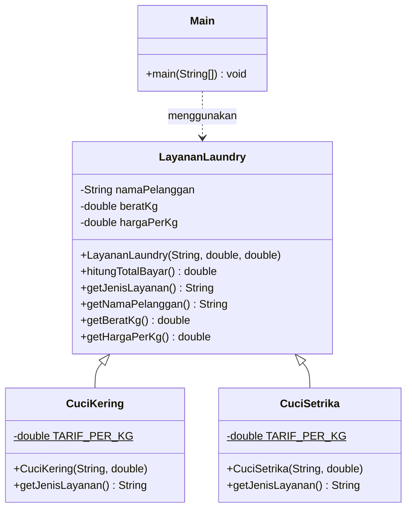

# Sistem Transaksi Laundry Kiloan

## 1. Identitas Mahasiswa

> Nama : Awang Rifky Muhadzib NIM : 2509116059

## 2. Studi Kasus

Program ini adalah aplikasi konsol (CLI) untuk mencatat transaksi laundry kiloan. Kasir memilih jenis layanan, memasukkan nama pelanggan dan berat cucian, lalu program menghitung total bayar dan mencetak nota di terminal.

Ada dua jenis layanan:

| Layanan | Tarif |
|---|---|
| Cuci Kering | Rp6.000 / kg |
| Cuci Setrika | Rp9.000 / kg |

Fitur program:

- Menu pilihan jenis layanan.
- Input nama pelanggan, pilihan layanan, dan berat cucian (kg). Berat boleh ditulis `2,5` atau `2.5`.
- Validasi input: nama tidak boleh kosong, pilihan hanya 1 atau 2, berat harus angka lebih dari 0.
- Nota transaksi berisi tanggal, nama pelanggan, layanan, berat, harga per kg, dan total bayar.
- Transaksi bisa diulang tanpa menjalankan ulang program.

## 3. Struktur Project

```
SistemTransaksiLaundryKiloan/
└── src/
    ├── com/mycompany/sistemtransaksilaundrykiloan/
    │   └── Main.java
    └── model/
        ├── LayananLaundry.java
        ├── CuciKering.java
        └── CuciSetrika.java
```

| File | Fungsi |
|---|---|
| `Main.java` | Menampilkan menu, membaca input, membuat objek layanan, mencetak nota |
| `LayananLaundry.java` | Superclass: atribut dasar dan method `hitungTotalBayar()` |
| `CuciKering.java` | Subclass dengan tarif Rp6.000/kg |
| `CuciSetrika.java` | Subclass dengan tarif Rp9.000/kg |

## 4. Diagram Kelas dan Hierarki Class



Hierarki dalam bentuk teks:

```
LayananLaundry        (superclass)
├── CuciKering        (subclass, Rp6.000/kg)
└── CuciSetrika       (subclass, Rp9.000/kg)
```

## 5. Penerapan Inheritance

Inheritance ada di tiga file: `LayananLaundry.java` sebagai superclass, `CuciKering.java` dan `CuciSetrika.java` sebagai subclass.

### a. Superclass `LayananLaundry`

Superclass menyimpan atribut dan logika yang sama untuk semua layanan, yaitu perhitungan total bayar.

```java
public class LayananLaundry {
    private final String namaPelanggan;
    private final double beratKg;
    private final double hargaPerKg;

    public LayananLaundry(String namaPelanggan, double beratKg, double hargaPerKg) {
        this.namaPelanggan = namaPelanggan;
        this.beratKg = beratKg;
        this.hargaPerKg = hargaPerKg;
    }

    public double hitungTotalBayar() {
        return beratKg * hargaPerKg;
    }

    public String getJenisLayanan() {
        return "Layanan Laundry";
    }
    // getter lainnya ...
}
```

### b. Subclass dengan `extends`

Kata kunci `extends` membuat `CuciKering` dan `CuciSetrika` mewarisi atribut dan method `LayananLaundry`. Method `hitungTotalBayar()` cukup ditulis satu kali di superclass dan langsung bisa dipakai kedua subclass.

```java
public class CuciKering extends LayananLaundry { ... }
public class CuciSetrika extends LayananLaundry { ... }
```

### c. Memanggil constructor superclass dengan `super`

Setiap subclass mengisi tarifnya sendiri lewat `super(...)`.

```java
public class CuciKering extends LayananLaundry {
    private static final double TARIF_PER_KG = 6000;

    public CuciKering(String namaPelanggan, double beratKg) {
        super(namaPelanggan, beratKg, TARIF_PER_KG);
    }
    // ...
}
```

### d. Mengganti method dengan `@Override`

Subclass mengganti `getJenisLayanan()` agar nota menampilkan nama layanan yang sesuai.

```java
@Override
public String getJenisLayanan() {
    return "Cuci Kering";
}
```

### e. Polymorphism di `Main`

Variabel bertipe superclass menampung objek subclass sesuai pilihan pengguna. Pemanggilan `hitungTotalBayar()` dan `getJenisLayanan()` tetap sama untuk kedua layanan.

```java
LayananLaundry layanan;
if (pilihan == 1) {
    layanan = new CuciKering(nama, berat);
} else {
    layanan = new CuciSetrika(nama, berat);
}
cetakNota(layanan);
```

Kalau ada layanan baru, misalnya "Cuci Saja", cukup tambah satu subclass baru tanpa mengubah logika perhitungan di superclass.

## 6. Screenshot Program

**Tampilan menu dan input:**


**Nota Cuci Kering:**


**Nota Cuci Setrika:**


